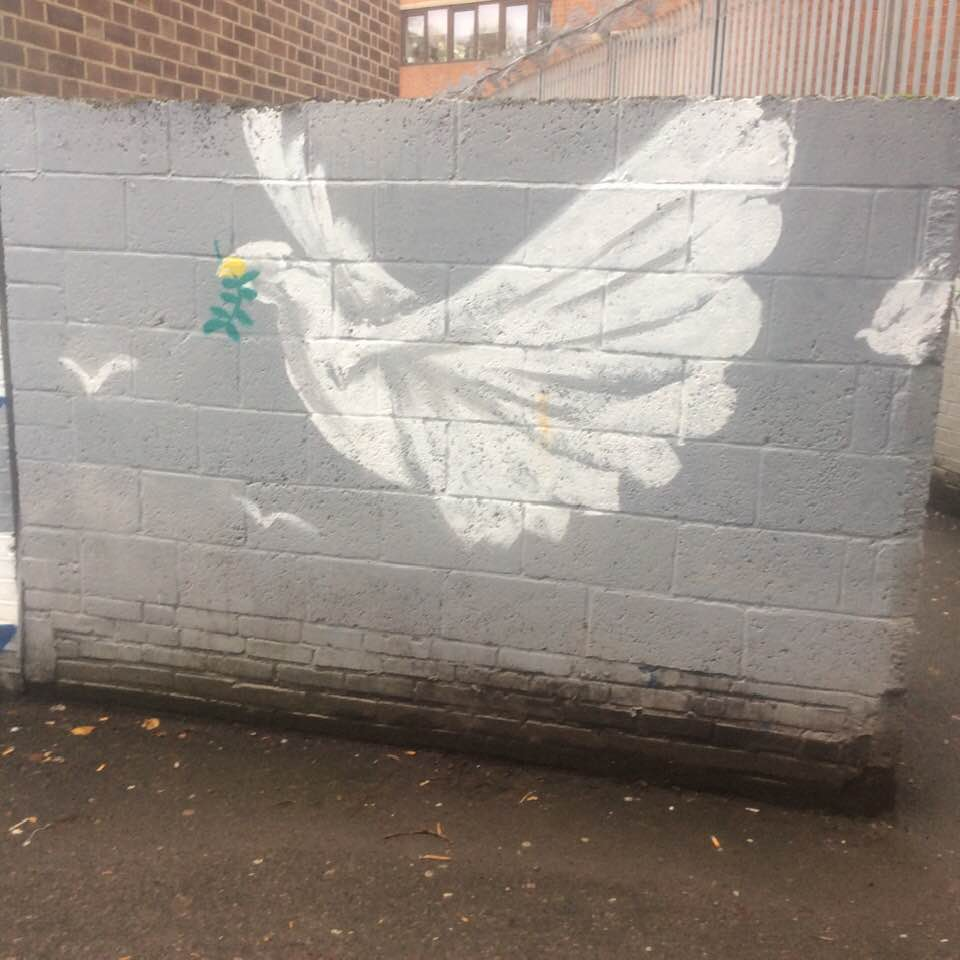

# Adding images...

-----

## Text link to image...

- [Dove of peace](dove-of-peace.jpg "Click link to see image...dove of peace")

1. [] written in square brackets: The text users will see to click on  
2. () written in circular brackets: The image link  
3. () written in circular brackets: The alt text...tool tip users see when mouse hovers over image.  

-----

## Image link...

-----
